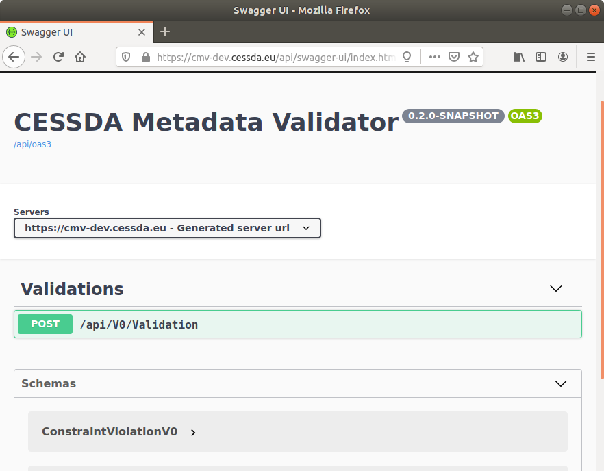
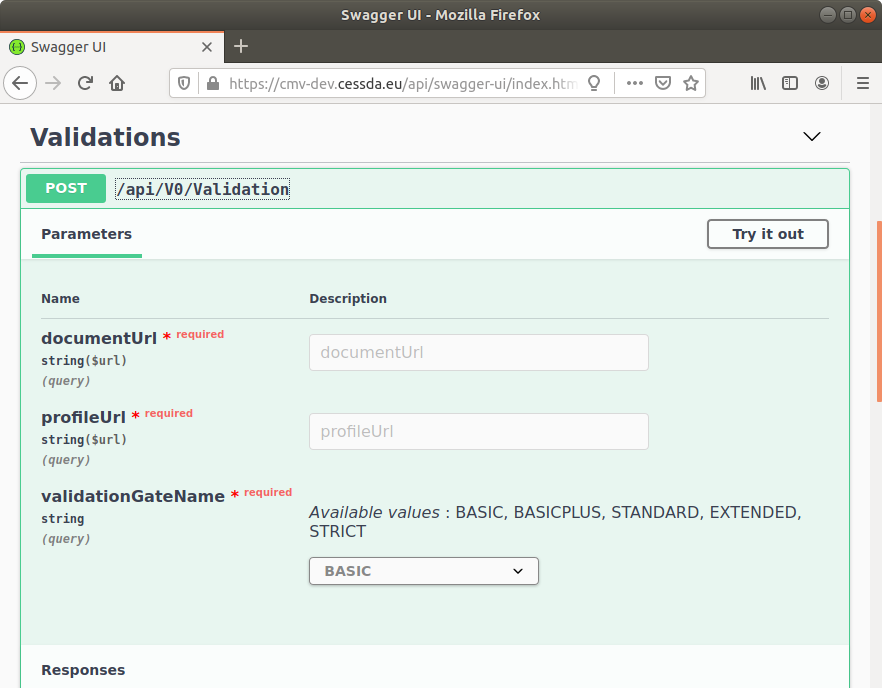
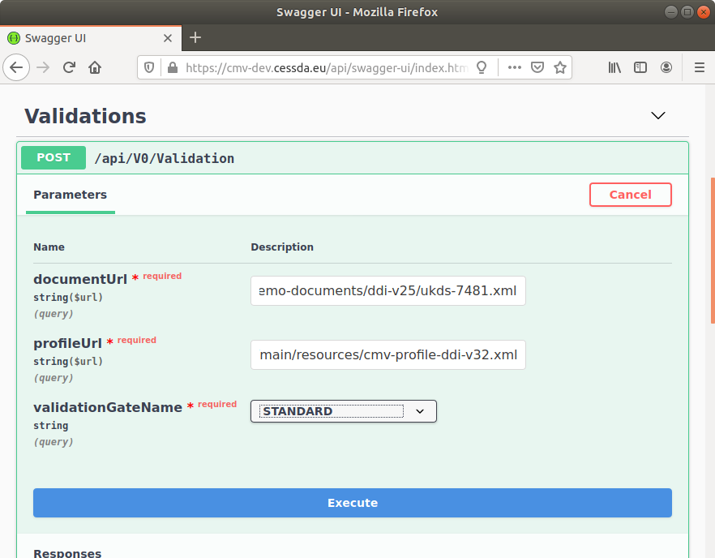
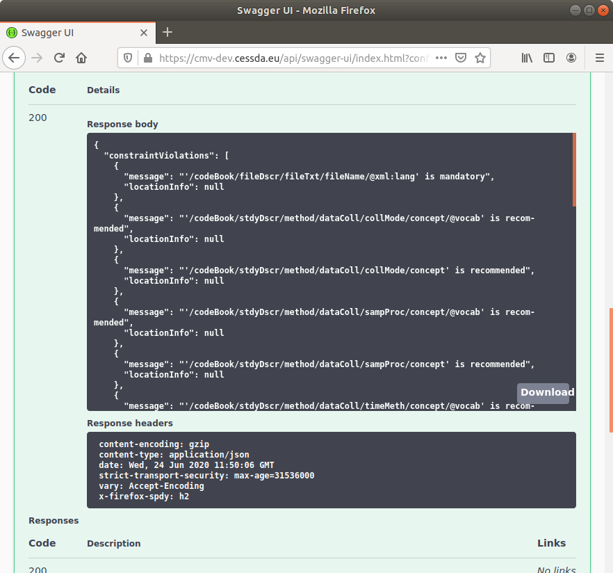

# {{ page.title }}

## Trigger validation with [curl](https://curl.se/)

### Use resolvable URLs for [document](glossary.html#document) and/or [profile](glossary.html#profile)

```bash
HOSTNAME=https://cmv[-dev].cessda.eu
DOCUMENT_URL=https://bitbucket.org/cessda/cessda.cmv.core/raw/ad7e3ffd847ecb9c35faea329fbc7cfe14bfb7a6/src/main/resources/demo-documents/ddi-v25/ukds-2000.xml
PROFILE_URL=https://bitbucket.org/cessda/cessda.cmv.core/raw/ad7e3ffd847ecb9c35faea329fbc7cfe14bfb7a6/src/main/resources/demo-documents/ddi-v25/cdc25_profile.xml

# If endpoint is secured with HTTP Basic Auth, add option --user $USERNAME:$PASSWORD
curl -s $HOSTNAME/api/V0/Validation \
  --request 'POST' \
  --header 'accept: application/json' \
  --header 'Content-Type: application/json' \
  --data '{
  "document": {
    "uri": "'"$DOCUMENT_URL"'"
  },
  "profile": {
    "uri": "'"$PROFILE_URL"'"
  },
  "validationGateName": "BASIC"
}'
```

### Use JSON-escaped XML-content of document and/or profile

```bash
DOCUMENT_CONTENT=`curl -s $DOCUMENT_URL | jq -Rs .` # Escaping XML to JSON is still not correct!

curl -s $HOSTNAME/api/V0/Validation \
  --request 'POST' \
  --header 'accept: application/json' \
  --header 'Content-Type: application/json' \
  --data '{
  "document": {
    "content": "'"$DOCUMENT_CONTENT"'"
  },
  "profile": {
    "uri": "'"$PROFILE_URL"'"
  },
  "validationGateName": "BASIC"
}'
```

## Trigger validation with Swagger / [OpenAPI 3.0](https://swagger.io/specification)
Please note: There is an integration problem with Swagger and Spring-Boot reported: [Swagger does not reuse configured Jackson objectMapper Spring bean](https://bitbucket.org/cessda/cessda.cmv.server/issues/43)

### Step 1 
* Browse to [Swagger user interface](../api/swagger){:target="_blank"}



### Step 2
* Click on endpoint `POST /api/V0/Validation` (green box)
* Click on the button `Try it out`



### Step 3
* Enter an url for the document, e.g. [DDI Codebook UKDS 2000](https://bitbucket.org/cessda/cessda.cmv.core/raw/8d0ea9d6a731fa06bde8c8f2b231c2e974aa7130/src/main/resources/demo-documents/ddi-v25/ukds-2000.xml)
* Enter an url for the profile, e.g. [CDC Profile v0.31](https://bitbucket.org/cessda/cessda.cmv.core/raw/8d0ea9d6a731fa06bde8c8f2b231c2e974aa7130/src/main/resources/demo-documents/ddi-v25/cdc25_profile.xml)
* Select a validation gate
* Click on button `Execute`



### Step 4
* Scroll down and see constraint violation messages in the response body
* If this list is empty, the document is valid


